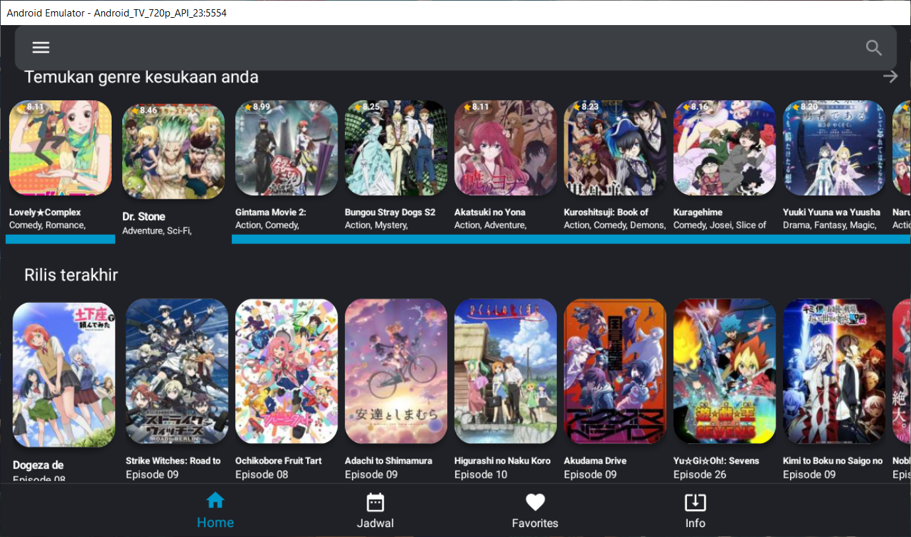

# Technime Android TV/Mobile Anime Streaming App
This App scrapes links from various anime streaming websites and displays them in the App

# Libraries
* Google Lean back
* Android.x Appcompact
* Glide
* Okhttp, Volley
* JSOUP
* Gson
* All the sites used in the application

# Mobile Android Images

  
   
  

  
   

# TV Android Images
    

# Features
* This Application is Free and 100% Ad Free ✅
* Main Ui page is Regularly updated with the Latest anime ✅
* Added a Watch list to allow you to save anime ✅
* Added a Filter Genre ✅
* Added a search page that allows you to search anime ✅
* Added a multiple servers that you can use to stream anime ✅
* Added a view all anime page that allows you to find new anime to watch ✅

<a href= "https://github.com/systemcalls-null/Technime/raw/main/Technime%201.0.apk">Download Link  
